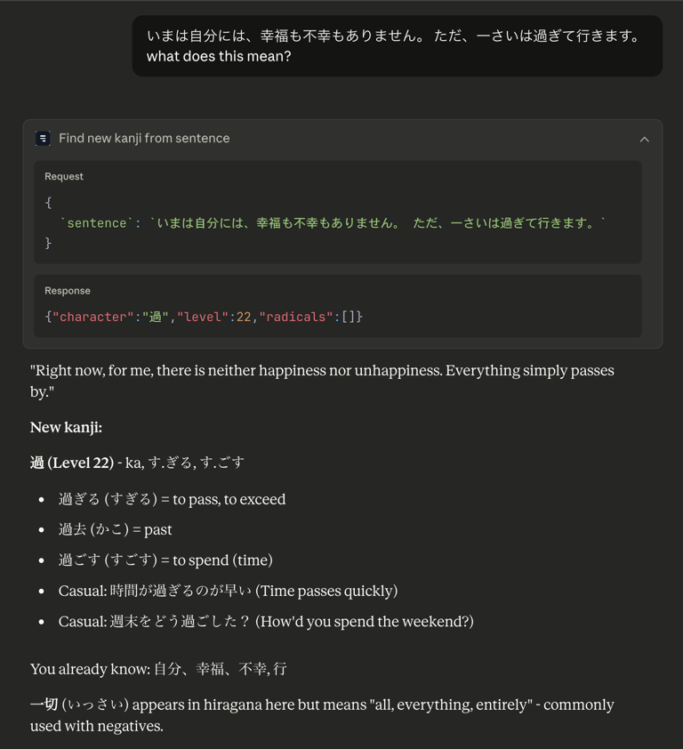
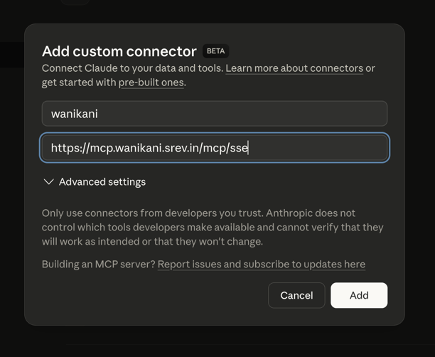

# wanikani-mcp
[MCP](https://modelcontextprotocol.io/docs/getting-started/intro) server for [wanikani](https://www.wanikani.com/).



## Setup
Get your API key from https://www.wanikani.com/settings/personal_access_tokens.
Do not grant any write permissions (leave all boxes unchecked).

### Docker
```json
{
  "mcpServers": {
    "wanikani": {
      "command": "docker",
      "args": [
        "run", "-i", "--rm", "ghcr.io/srevinsaju/wanikani-mcp:main",
        "--mode", "stdio",
        "--api-key", "YOUR_WANIKANI_API_KEY"
      ]
    }
  }
}
```

### Local
```bash
{
  "mcpServers": {
    "wanikani": {
      "command": "cargo",
      "args": [
        "run", "--release", "--git", "https://github.com/srevinsaju/wanikani-mcp.git",
        "--branch", "main", "--",
        "--mode", "stdio",
        "--api-key", "YOUR_WANIKANI_API_KEY"
      ]
    }
  }
}
```


### Remote SSE Server

On claude desktop, go to `Settings > Connectors` and add a new server.



This should also work on Claude Mobile.


## Tools

- `get_level_info` - get level information
- `get_subject_by_id` - get subject by its subject id
- `get_kanji_by_character` - get kanji with readings, mnemonics, and radicals
- `get_vocabulary_by_phrase` - get vocabulary with readings, mnemonics, and example sentences
- `find_new_kanji_from_sentence` - find new kanji from a sentence that user hasn't learned
- `find_new_vocabulary` - find new vocabulary from a list of phrases that user hasn't learned

## Authentication

This server implements oauth2 with a custom flow. When using the SSE mode, the wanikani api key is embedded directly in the jwt token, which may be against best practices.
For local usage with stdio mode, the api key is passed directly via command line argument.

## Building

```bash
cargo build --release
```

```bash
docker build -t wanikani-mcp .
```

## license

MIT
